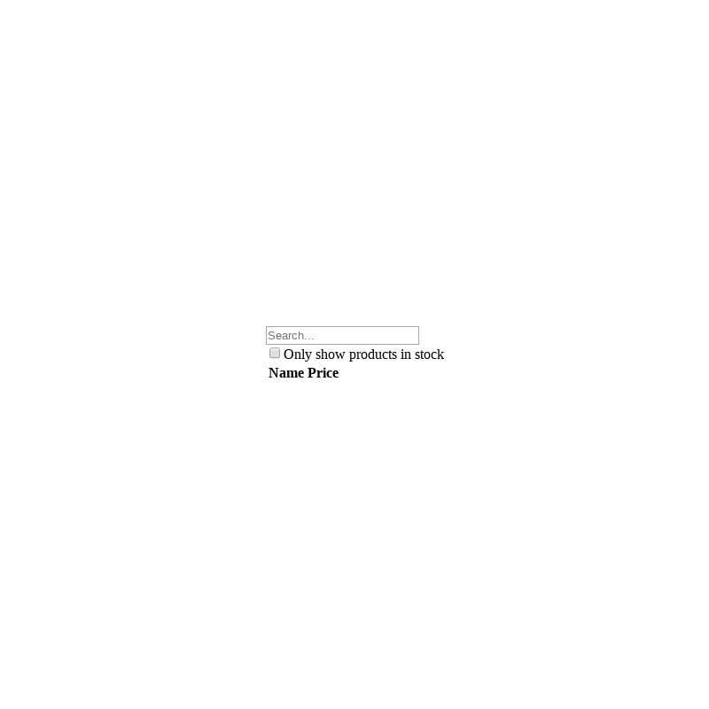

# `<FilterableProductTable />`

Displays a collection of products as a table.

## Example

> Image location: [`.loki/reference/chrome_FilterableProductTable_default.png`](../../../.loki/reference/chrome_FilterableProductTable_default.png)
>
> To regenerate:
> 1. `npm run test:playground` (skip if running)
> 1. `npm run test:visual:update -- --storiesFilter="^FilterableProductTable default\$"`